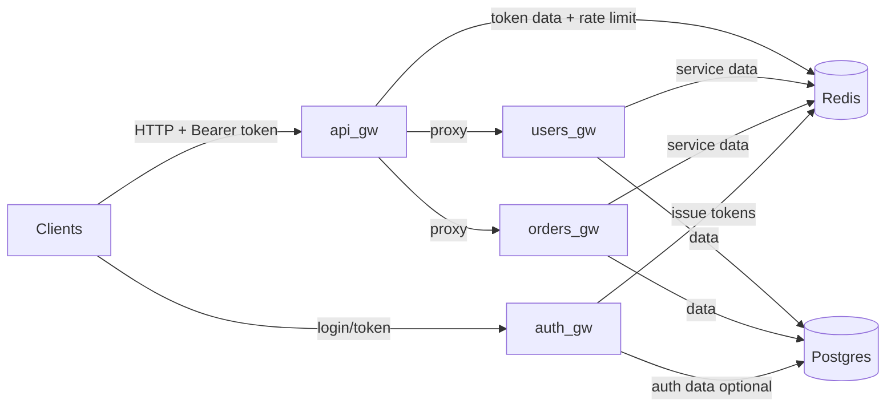
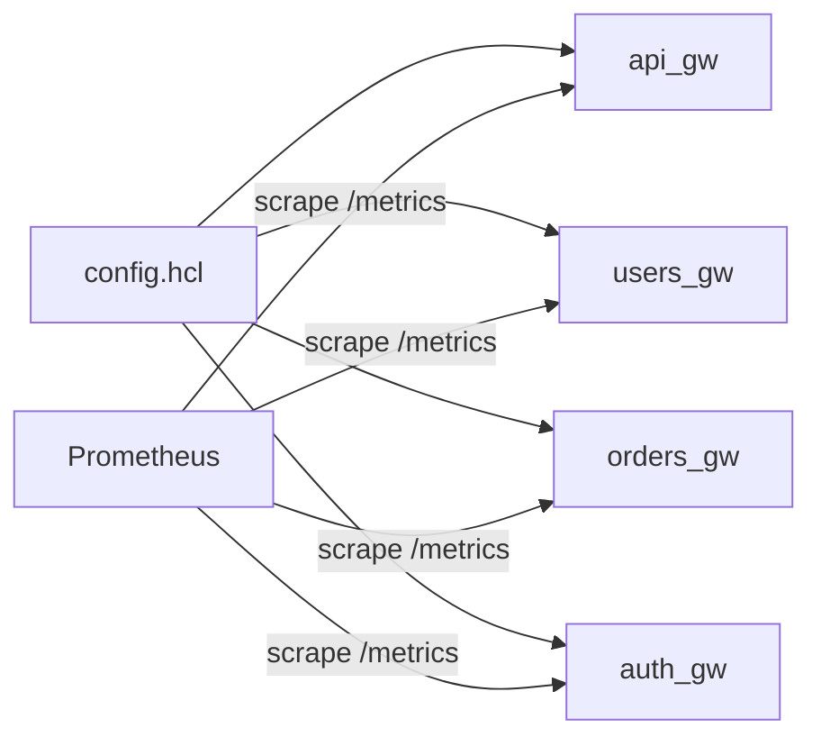
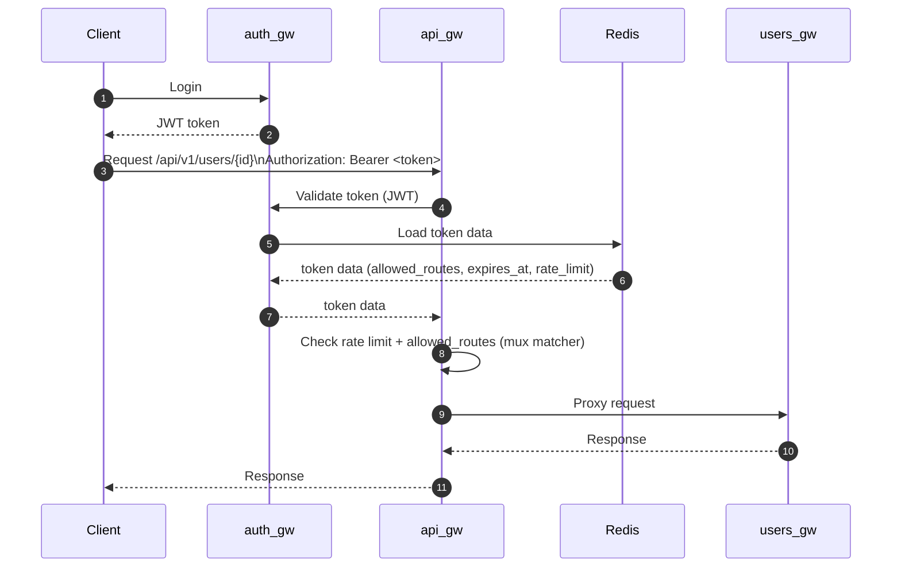
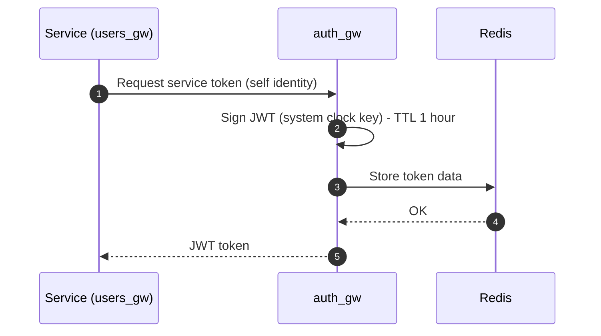
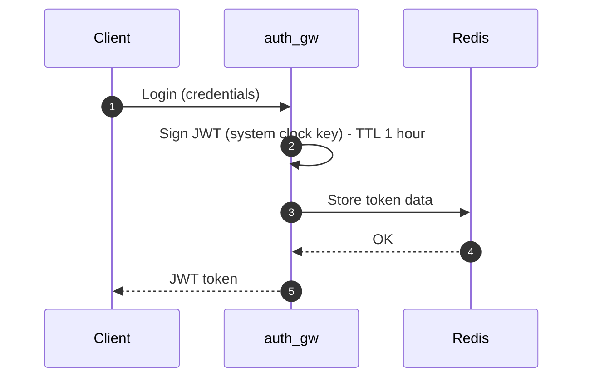

# API Gateway Service Diagrams

## System Overview (Core Traffic)

## Configuration and Observability

## Request Flow (Client -> Gateway -> Backend)

## Auth Token Issuance (Service-to-Service Example)

## Auth Token Issuance (Client Example)

