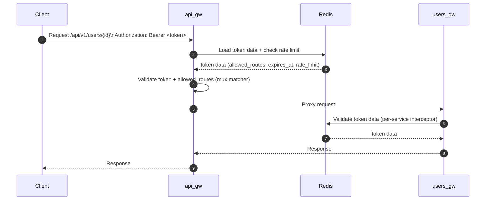

# API Gateway Service Diagrams

## System Overview

```mermaid
flowchart LR
  client[Clients] -->|HTTP + Bearer token| api_gw[api_gw]
  api_gw -->|proxy| users_gw[users_gw]
  api_gw -->|proxy| orders_gw[orders_gw]
  client -->|login/token| auth_gw[auth_gw]

  api_gw -->|token data + rate limit| redis[(Redis)]
  users_gw -->|token validation + data| redis
  orders_gw -->|token validation + data| redis
  auth_gw -->|issue tokens| redis

  users_gw -->|data| postgres[(Postgres)]
  orders_gw -->|data| postgres
  auth_gw -->|auth data (optional)| postgres

  prometheus[Prometheus] -->|scrape /metrics| api_gw
  prometheus -->|scrape /metrics| users_gw
  prometheus -->|scrape /metrics| orders_gw
  prometheus -->|scrape /metrics| auth_gw

  config[config.hcl] --> api_gw
```

## Request Flow (Client -> Gateway -> Backend)



## Auth Token Issuance (Service-to-Service Example)


